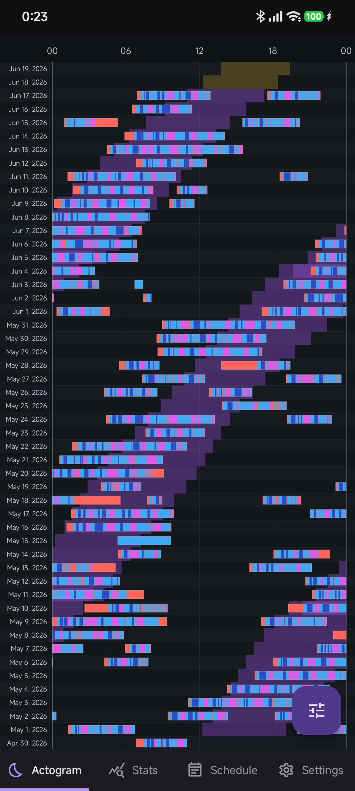
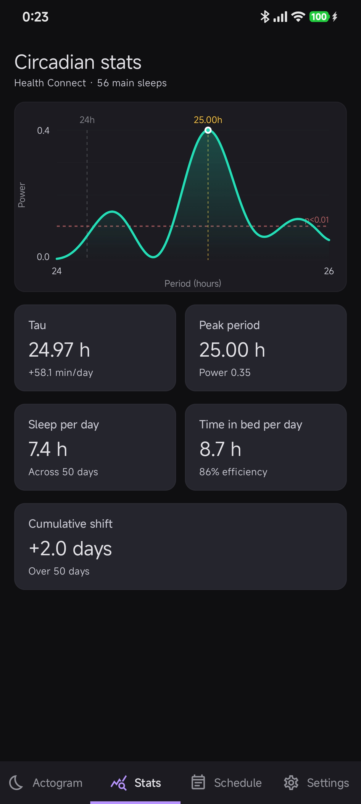

# Dark Hour Android

Dark Hour Android is a native Android/Jetpack Compose app for inspecting sleep,
circadian timing, and schedule alignment from Health Connect data. It adapts
the analysis behavior of the original Dark Hour web implementation
([Aozora7/darkhour](https://github.com/Aozora7/darkhour),
[25h.aozora.one](https://25h.aozora.one)) into an Android-first interface.

## Screenshots

<div align="center">
  
  
</div>

## Features

- Health Connect sleep import with a default 30-day range and optional
  all-history access.
- Dense actogram with sleep stages, circadian windows, schedule overlays,
  newest/oldest ordering, 24-hour/tau/custom row widths, and double plot mode.
- Circadian and periodogram statistics derived from deterministic Kotlin core
  algorithms.
- Weekly or dated schedule blocks that render on the actogram.
- Settings for naps, forecast range, date/time format, and Health Connect
  import range.

## Project Structure

- `core/` contains pure Kotlin/JVM domain models and analysis algorithms.
- `app/` contains Android, Compose UI, Health Connect integration, persistence,
  and presentation state.

The core module has no AndroidX, Compose, or Health Connect dependencies.
Health Connect records are converted to Dark Hour `SleepRecord` models at the
app boundary before analysis.

## Build And Test

Requirements:

- JDK 11 compatible toolchain
- Android SDK with the configured compile SDK
- A device or emulator with Health Connect for real data import

Run tests and build debug artifacts:

```powershell
.\gradlew.bat test :app:assembleDebug :app:assembleAndroidTest
```

Run connected Compose tests:

```powershell
.\gradlew.bat :app:connectedDebugAndroidTest
```

Connected tests require APK installation to be allowed on the device.

