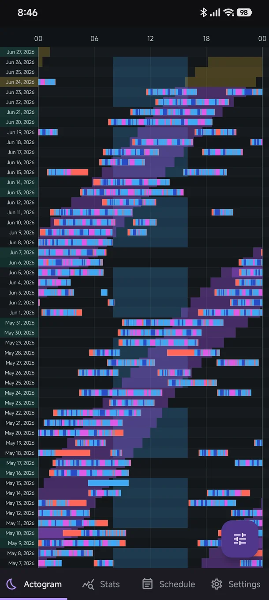
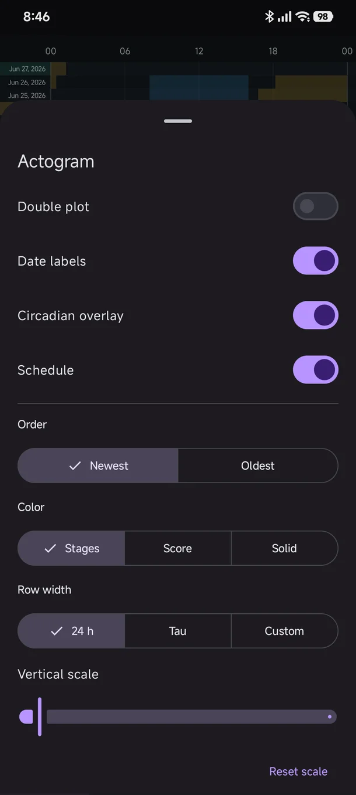
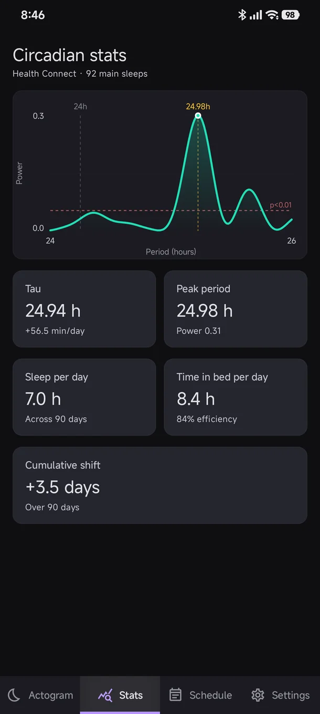
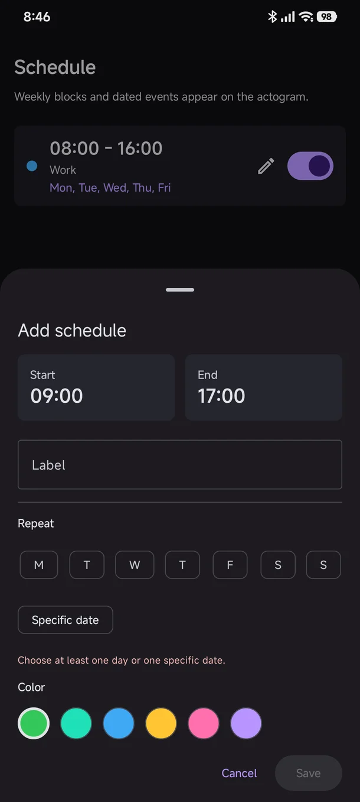
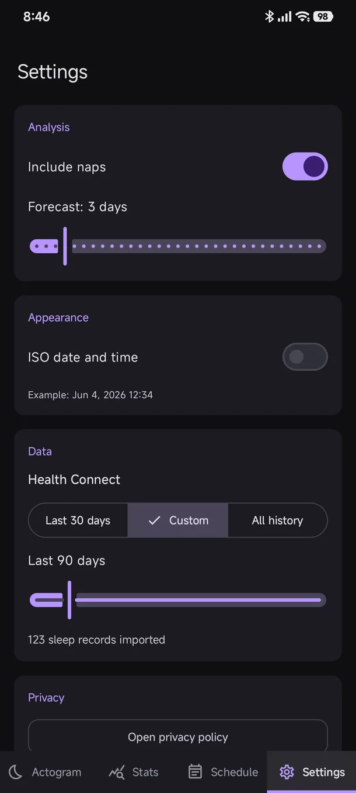

# Dark Hour Android

Dark Hour Android is a native Android/Jetpack Compose app for inspecting sleep,
circadian timing, and schedule alignment from Health Connect data. It is an Android native reimlementation of [25h.aozora.one](https://25h.aozora.one)
([Aozora7/darkhour](https://github.com/Aozora7/darkhour)) that uses Health Connect instead of Google Health API as the source of data, making it usable with more wearable vendors.


## Screenshots

<div align="center">
  
  
  
  
  
</div>

## Features

- Dense actogram that can fit several months of data on one screen
- Actrogram customization
- Circadian night estimation from sleep data
- Extrapolation for circadian night into the future for planning
- Periodogram for circadian frequency analysis
- Ability to display weekly schedule or individual events on the actogram

## Project Structure

- `core/` contains pure Kotlin/JVM domain models and analysis algorithms.
- `app/` contains Android, Compose UI, Health Connect integration, persistence,
  and presentation state.

The core module has no AndroidX, Compose, or Health Connect dependencies.
Health Connect records are converted to Dark Hour `SleepRecord` models at the
app boundary before analysis.

## Build And Test

Requirements:

- JDK 11 compatible toolchain
- Android SDK with the configured compile SDK
- A device or emulator with Health Connect for real data import

Run tests and build debug artifacts:

```powershell
.\gradlew.bat test :app:assembleDebug :app:assembleAndroidTest
```

Run connected Compose tests:

```powershell
.\gradlew.bat :app:connectedDebugAndroidTest
```

Connected tests require APK installation to be allowed on the device.
